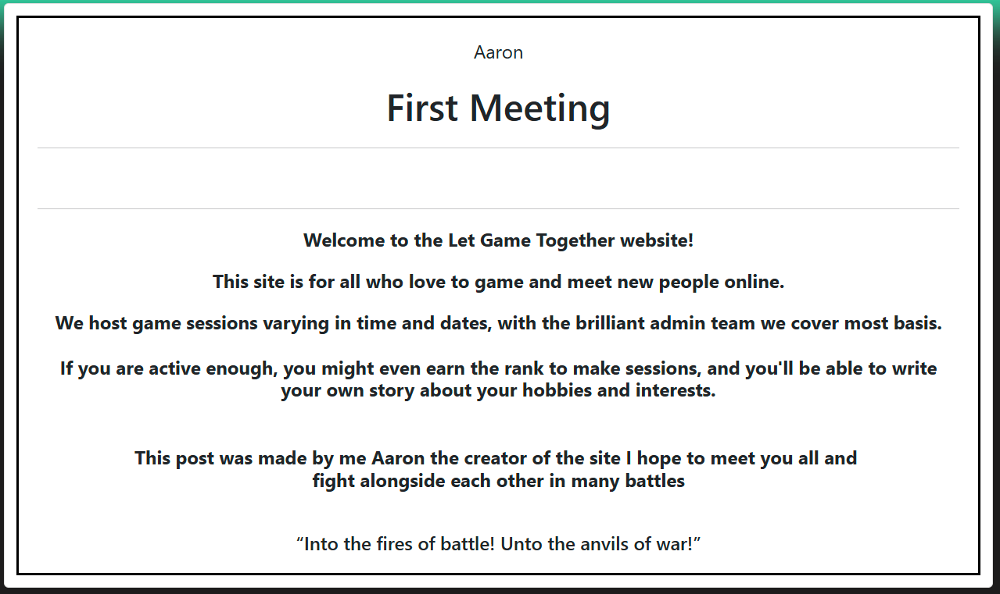

## Code Validation
### Js Hint
I ran my file through js hint and all the warnings are about the js version im using and the last one was about 
about using a variable outside of the loop 
 
 
### W3C HTML Validator
The html I struggled with because of the mix of elements being added I didn't know what line they would be on
when doing the html we found that the models where that i had a if statement out of alignment

### W3C CSS Validator
I haven't really used much css i used bootstraps basic css

### Python Syntax Checker PEP8 Validation
all easy fixes mainly white spaces and lines that are too long.

### Lighthouse

# Responsiveness

# Manual Testing

## Home Page
The home page testing involves testing all links and when the message is updated it shows the update.
### Nav Bar

During the testing phase, I will systematically verify that all links at the top of the page function correctly. Each link should open the corresponding page and display the appropriate content. For instance, clicking on the “About” page should navigate to the page and load the “About Me” message without any errors.

During the testing phase, I will thoroughly verify the functionality of all links on each page. For example, while on the “About” page, I will ensure that clicking the link to the “Game Session” page navigates correctly and displays the appropriate content. All tests conducted were completed successfully and passed without any errors.
Navigation Bar Manual Test Documentation
Objective
To ensure that the navigation bar functions correctly, all links navigate to the appropriate pages, and the correct content is displayed without any errors.

#### Test Environment
- Browser: [Microsoft Edge]
- Operating System: [Windows 11]
- Application URL: [localhost:800]
#### Pre-requisites
- User should be logged in (if applicable).
- The application should be running and accessible.
#### Test Cases
- Verify Navigation Bar Visibility
- Step: Open the application URL.
- Expected Result: The navigation bar should be visible at the top of the page.
Verify Home Link
- Step: Click on the “Home” link in the navigation bar.
- Expected Result: The application should navigate to the Home page, and the Home page content should be displayed correctly.
- Verify About Link
- Step: Click on the “About” link in the navigation bar.
- Expected Result: The application should navigate to the About page, and the About page content should be displayed correctly.
- Verify Game Sessions Link
- Step: Click on the “Game Sessions” link in the navigation bar.
- Expected Result: The application should navigate to the Game Sessions page, and the Game Sessions page - content should be displayed correctly.
#### Is It Responsive ?
- Verify Responsive Design
- Step: Resize the browser window to different screen sizes (mobile, tablet, desktop).
- Expected Result: The navigation bar should adjust its layout appropriately and remain functional on all screen sizes.
#### Error Handling
Verify Error Handling
Step: Click on a broken or non-existent link in the navigation bar.
Expected Result: The application should display a 404 error page or a relevant error message.

### Welcome Message Update From Admin
This test involves updating the welcome message text on the admin page and subsequently verifying that the changes are reflected on the user interface. Specifically, after modifying the welcome message in the admin panel, I will check the user side to ensure the updated message is displayed correctly.

 

## Game Session Pages
### Objective
To ensure that the Django views for managing game sessions and comments function correctly, including listing game sessions, displaying post descriptions, updating player counts, editing comments, and deleting comments.

#### Test Environment
- Browser: [Specify browser name and version]
- Operating System: [Specify OS name and version]
- Application URL: [Specify the URL of the application]
- Django Version: [Specify Django version]
- Database: [Specify database type and version]
#### Pre-requisites
- User should be logged in (if applicable).
- The application should be running and accessible.
- Test data should be available in the database (e.g., posts and comments).
#### Test Cases

##### Game Session List View
- Step: Navigate to the game sessions list page.
- Expected Result: The page should display a list of game sessions, paginated by 3 items per page.

##### Post Description View
- Step: Click on a game session to view its details.
- Expected Result: The post description page should display the post details, comments, and a comment form.
##### Adding a Comment
- Step: On the post description page, submit a new comment using the comment form.
- Expected Result: The comment should be saved, and a success message should be displayed. The comment - should appear in the list of comments, pending approval.

##### Editing a Comment
- Step: Edit an existing comment on a post.
- Expected Result: The comment should be updated, marked as not approved, and a success message should be displayed.

##### Deleting a Comment
- Step: Delete an existing comment on a post.
- Expected Result: The comment should be deleted, and a success message should be displayed.

### Detailed Steps
Game Session List View
URL: /game_sessions/
Steps:
1. Open the application URL.
2. Navigate to the game sessions list page.
3. Verify that the page displays a list of game sessions.
4. Verify pagination by navigating through the pages.

#### Post Description View
URL: /game_sessions/<post_slug>/
- Steps:
    1. Click on a game session link.
    2. Verify that the post description page loads correctly.
    3. Verify that the post details, comments, and comment form are displayed.

#### Adding a Comment
URL: /game_sessions/<post_slug>/
- Steps:
    1. On the post description page, fill out the comment form.
    2. Submit the form.
    3. Verify that the comment is saved and a success message is displayed.
    4. Verify that the comment appears in the list of comments, pending approval.

#### Editing a Comment
URL: /edit_comment/<comment_id>/<post_slug>/
- Steps:
    1. Navigate to the edit comment page.
    2. Edit the comment and submit the form.
    3. Verify that the comment is updated and marked as not approved.
    4. Verify that a success message is displayed.
#### Deleting a Comment
URL: /comment_delete/<post_slug>/<comment_id>/
- Steps:
    1. Trigger the delete action for a comment.
    2. Verify that the comment is deleted.
    3. Verify that a success message is displayed.
##### Post-conditions
Ensure all views and functionalities are tested and verified.
Document any issues or bugs found during testing.

## About

