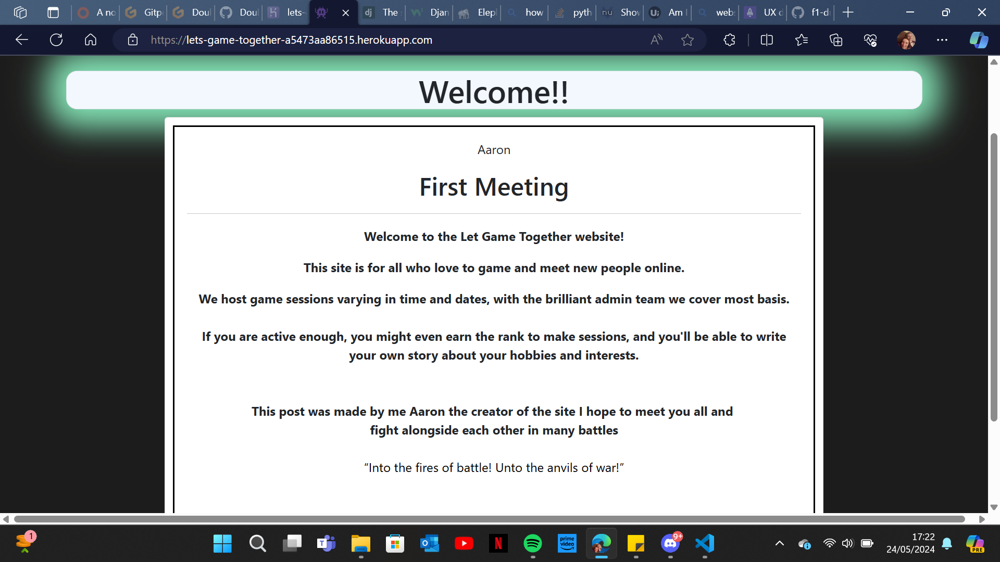
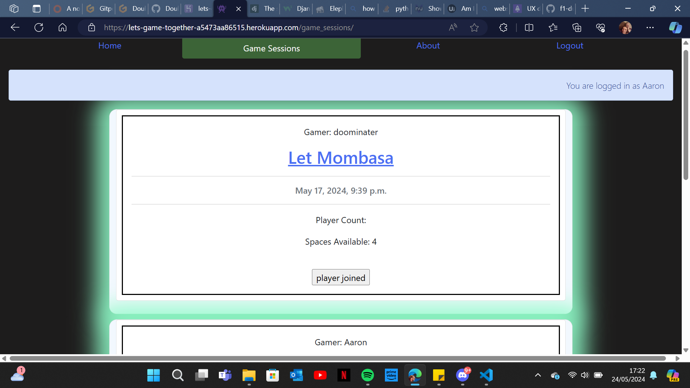
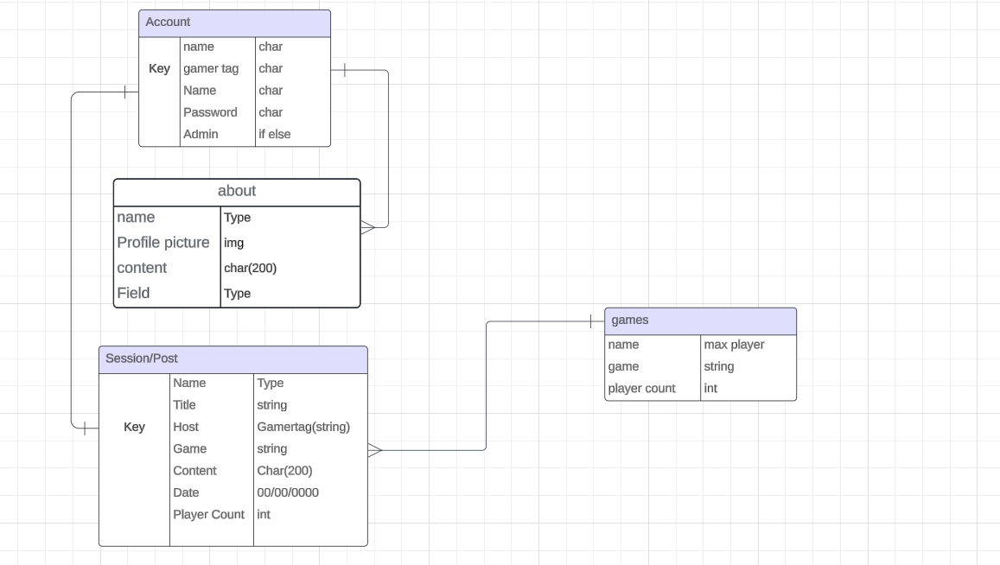
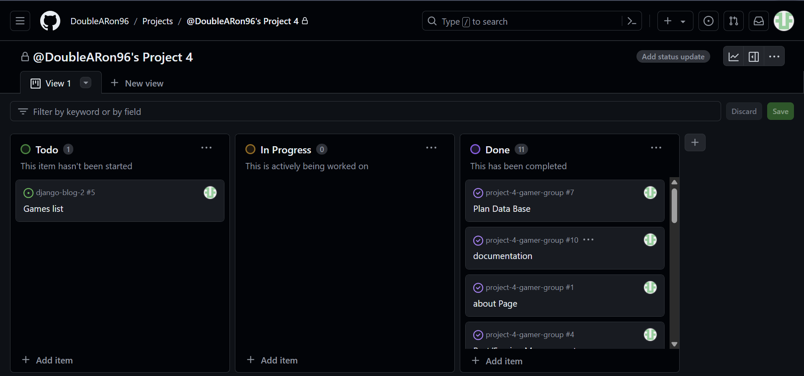
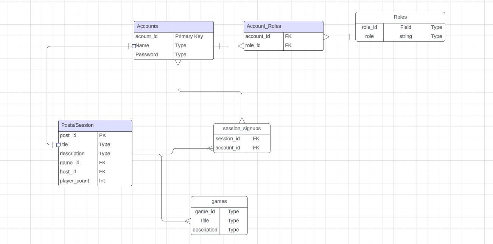

### Game Together

## Introduction
The “Game Together” project is a personal initiative designed to address a perceived need in the community. This project is built on a straightforward and uncomplicated concept, with a simple layout and logic to ensure ease of use. The primary objective is to create a platform that facilitates group gaming, making it easier for adults and young adults to come together and enjoy gaming in a collaborative environment.

## Visit the Website Here
[website link](https://lets-game-together-a5473aa86515.herokuapp.com/)

## Visit the Project's GitHub Repository Here
[Repo link](https://github.com/DoubleARon96/project-4-gamer-group)

## Website Highlights

# Purpose
The purpose of this website is to bring people together in a controlled and monitored environment for gaming. The goal is to make it easier for individuals with limited spare time, like myself, to find gaming partners. To enhance security, the site includes features that allow admins and superusers to create gaming sessions, which can only be joined by registered users.

# UX
The design inspiration stems from the Xbox colour scheme, particularly the newer models, which feature a darker base colour complemented by a subtle glow reminiscent of the power button.

To enhance the user experience, I focused on creating a clean and straightforward design. This approach ensures that the app is not cluttered with excessive images, links, or features on a single page, thereby providing a seamless and enjoyable user experience.

The UX can be broken down into

- The Strategy Plane
- The Scope Plane
- The Structure Plane
- The Skeleton Plane
- The Surface Plane

## Strategy

This is the initial data plan I developed for all the models.

This is the Initial plan for each page

When planning the site I could relate to the group i am aiming to draw in.

so when planning i thought about how i struggle to play groupe games now because all my friends have different hours, so i thought if i could make a site that can be assessed at anytime and responses don't have to be instant.

Target audience :
* 18 to 50 years old 
* people that are working full time and have not a lot of spare time.
* people that like to game in groups 

## User Stories

| id  |  Title | Content |
| ------ | ------ | ------ |
| [1] |About Page Info Page :| as a site user I will be able to click on and view admin stories and about them

AC1 When the info page link is clicked you can view the page

Admins can update this page: As an admin, I can make updates and change the info on this page.

AC1 This will be visible in the admin page|
| [2]|Approve Posts
 | As a site admin, I will be able to approve posts from none admins and approve comments on posts made

Given a logged in user, they can approve a posts and disapprove a post/ comment | Could Have |
| [3]|Posts/Sessions| Posts/sessions: as a user i will be able to click on posts view them and join the posts / sessions

- AC1 Be able to click and view the post
- AC2 Be able to join in sessions by clicking
- AC3 have a limited number of users that can join depending on game
- AC4 be able to unjoin sessions |
| [4]|Post/Session Management | As a Site Admin I can create, read, update and delete posts so that I can manage my content
* Given a logged in user, they can create a post
* Given a logged in user, they can read a post
* Given a logged in user, they can update a post
* Given a logged in user, they can delete a post |
| [5]|Account registration | As a Site User I can register an account so that I can comment on a post
- Given an email a user can register an account.
- Then the user can log in.
- When the user is logged in they can comment.|
| [6]|View Paginated Posts/Sessions | As a site user, I can view a paginated list of posts so that I can select which post I want to view

- Given more than one post in the database, these multiple posts are listed.
- When a user opens the main page a list of posts is seen.
- Then the user sees all post titles with pagination to choose what to read. |
| [7]|Plan Data Base| Plan out how the database should look E.g.
- First Name , Surname , Date of birth|
| [8]|Edit and Delete Posts/Sessions| 
* Edit
- AC1 : users must be able to change and add comments
* Delete
- AC1 : users and admins can delete posts and comments|
| [9]|Styles And Views Bugs| Get models to view on pages
- get CSS to link up
- Centre game lists|
| [10]Documentation| fill out the read me with full details |
\
&nbsp;
[link to project stories](https://github.com/users/DoubleARon96/projects/5/views/1)
All major tasks were completed and successfully transitioned during the workflow.

## For the Future
In the future, we aim to enhance interactivity by incorporating features such as voice chat for sessions. Additionally, users will have the capability to post images from games and create profiles with logos or profile pictures.

# Structure
The project features a user-friendly layout to ensure ease of use and navigation. It integrates seamlessly with the database, enabling updates and modifications to be made from the admin page. Additionally, all questions can be edited or deleted as required.

## Project Databases

This was my initial plan for the databases; however, I have since refined it to better align with the project’s requirements. There are now three databases: one for the homepage welcome message, one for the game sessions, and one for the about page.

## Accounts 
User accounts serve as the authentication mechanism, allowing users to navigate the site. If users do not meet the specified requirements, they will be restricted from accessing certain areas of the site. This ensures that only authorized users can fully utilize the platform’s features.

## Posts/Sessions
This system will store the data of the users who created it, as well as the players who leave questions in the designated section. It will also record the game being played, the number of participants, and a brief description of the host’s plans.

the models can be broken down into

* Post_id: A text value used for selecting specific posts.
* Gamer_tag: The username associated with the user’s account.
* Datetime: The date and time for the gaming session.
* Game: The game that the user plans to play. If the game is not listed, an alternative option can be selected.
* Player_count: Specifies the maximum number of players allowed in the session.
* Updated_on: Records the timestamp of any changes made to the data.
* Slug: A unique identifier created to resolve issues with linking comments to the correct post_id.
* Joined_status: A boolean value indicating whether a user has joined the session (currently not in use).

# Surface
The surface refers to the visual appearance and layout of the webpage, primarily defined by HTML and CSS. This includes the structure, design, and overall aesthetic of the site. HTML (HyperText Markup Language) is used to create the basic structure and content of the webpage, while CSS (Cascading Style Sheets) is used to style and format the HTML elements, ensuring a visually appealing and user-friendly interface.
## Font
The website uses the default font as it perfectly complements the desired aesthetic.

## Icons
I utilized icons from Font Awesome due to its efficient and visually appealing symbols, which are easy to implement and enhance the overall design.

## Colours
I selected green, white, and black for the website’s color scheme because the glow effect enhances the gaming aesthetic. Additionally, the use of simple colors ensures that the text is easy to read. The combination of black and white provides excellent contrast, further improving readability.

## Responsive Screens
I utilized Bootstrap to make the site responsive, leveraging its column system to ensure the layout adapts seamlessly to any screen size.

# Features

  ## Home Page
  The homepage features a welcome message from the administrators, which will be manually updated throughout the year to reflect different seasons.
  

  ## Navigation Bar
  The navigation bar will adjust based on the user’s login status. This measure is implemented to prevent non-account holders from leaving messages anonymously, thereby enhancing safety.

  ## Questions
  The questions or comments section is designed to gather additional information from users who created the game session. This allows you to inquire about the mode, mission, or whether they plan to host another session.
  

## Django Template Pages
This project leverages Allauth to enable user registration, login, and logout functionalities on the website, offering excellent out-of-the-box capabilities.
 
# Technologies Used
## Languages
HTML: Used to create the Django templates for the associated views and models in the project applications.
* CSS: Utilized to style the website.
* JavaScript: Employed to handle button interactions and to create new stories on the about page.
* Python: The primary language of Django, used to develop all forms, models, and views.
* ElephantSQL – The final database used for the deployed project.
## Tools
* Django: The framework utilized in this project to integrate the databases with the website.
* Crispy Forms: Formats the models into forms on web pages.
* Gitpod: Used as the development environment.
* GitHub: Serves as the project’s version control system.
* Heroku: Used for deploying the website.
* [animate](https://animate.style/) - I used this for animations but haven't got around to adding them 
* [git commits](https://dev.to/phukon/how-i-write-commits-like-a-pro-340l?ref=dailydev) - I used this to help word and set out my commits
## Styling
* Bootstrap – To provide extra styling and positioning.
* Font Awesome – For the X's on the questions awaiting approval.
* animate.style - For animations

# Testing
[manual testing](MANUAL_TESTS.md "link to manual testing")

# Deployment
to deploy the project you will need to follow these :

1. Create Application
* Create a Heroku account if you don’t have one and login.
* Create a new application, by selecting the “new” button on the top right of the dashboard and click “Create new app”.
* Choose a unique name for the application and select the region you live in, followed by "Create App".
 
2. ElephantSQL
* Go to elephantsql.com, login with GitHub and create a new instance.
* Copy the URL once the project has been created.
* Install the dj-database-url package version 0.5.0 by using [pip3 install dj_database_url==0.5.0] to format the URL into one that Django can use, and don't forget to [pip freeze > requirements.txt].
 
3. Repo Preparations
* Make sure to make any migrations in the project, by typing [python3 manage.py makemigrations] followed by python3 [manage.py migrate] into the terminal.
* make a Procfile, which contains web: gunicorn [project_name].wsgi:application is added to the project.
 
4. Heroku Deploy
* Go back to Heroku and when the Project’s page opens up, go to the "settings" tab and scroll down to the “Config Vars” section.
* Enter the following key-value pairs in the “Config Vars” section:
* Key = PORT : Value = 8000
* Key = SECRET_KEY : Value = Django Secret Key value obtained from settings.py
* Key = DATABASE_URL : Value = ElephantSQL URL From the website.

* Go to the “Deploy” tab next and scroll down to the GitHub deployment method.
* Search for the sight repository and then connect to it by selecting the “Connect” button.
* Scroll down to the bottom of the “Deploy” Page and select the type of deployment you want to do. If you opt to “Automatically Deploy”, it will deploy every time you push new code to your repository or you will have to manually deploy it, by selecting the button at the bottom of the page.
The application is now deployed!
 
## Bugs 
# bug that are still there
1. when making a game session you still have to write the post_id in the top one and the slug field second from the bottom

## GitPod Reminders

To run a frontend (HTML, CSS, Javascript only) application in Codeanywhere and gitpod in the terminal, type:

`python3 -m http.server`

A button should appear to click: _Open Preview_ or _Open Browser_.

To run a frontend (HTML, CSS, Javascript only) application in Codeanywhere with no-cache, you can use this alias for `python3 -m http.server`.

`http_server`

To run a backend Python file, type `python3 app.py`, if your Python file is named `app.py` of course.

A button should appear to click: _Open Preview_ or _Open Browser_.

# Credits

A large amount of code came from the Code Institute, I Think Therefore I Blog Project.
Code Institute, I Think Therefore I Blog
I Think Therefore I Blog is a walkthrough project by Code Institute, this project gave students an introduction to Django/Stripe/
The core functionality of the strip and baskets is all taken from the I Think Therefore I Blog project.

### Bootstrap

The Bootstrap Library was used through the project. The project used version 5.3.3
Bootstrap
Toasts/Navigation Bar/Forms/Dropdown Menu/Buttons, the core elements mentioned are all found in the Bootstrap components section and built upon.
Django Documentation

### Django 
Django have amazing documentation with a tutorial project and in depth explanations on core components.
[django link](https://docs.djangoproject.com/en/5.1/ "Django Documentation Link")

## Credit
Ciaran Merrit
Code institue : i think blog
Grawnya : helped by showing and amazing Readme layout
Harry Dhillon