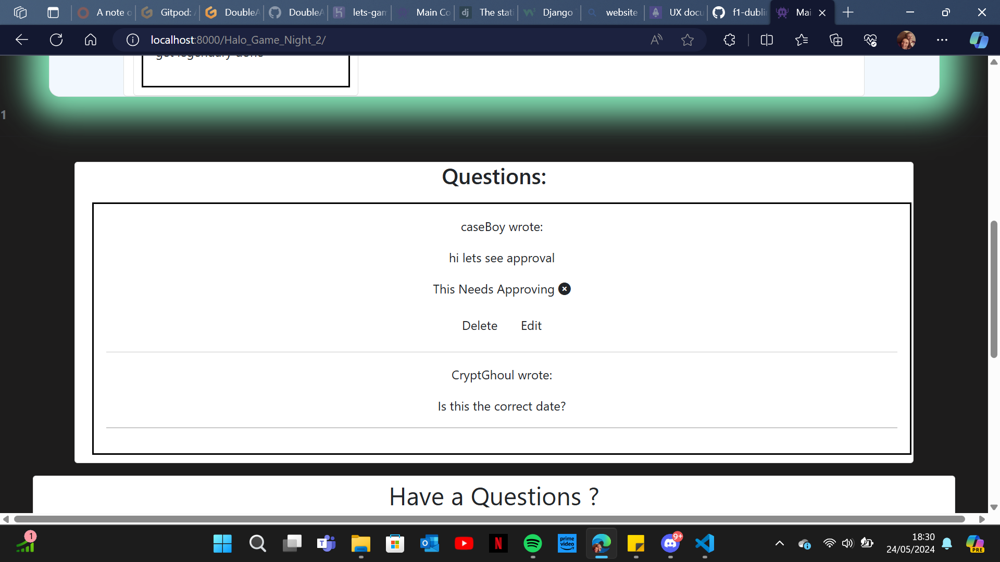
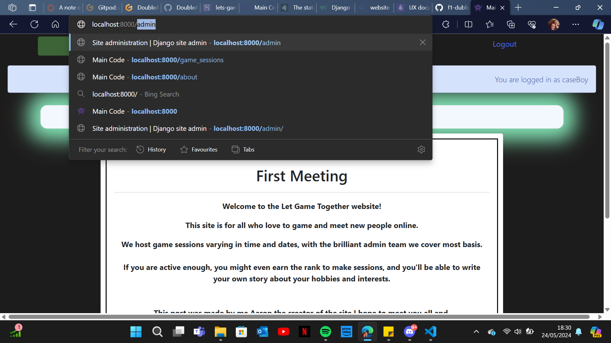
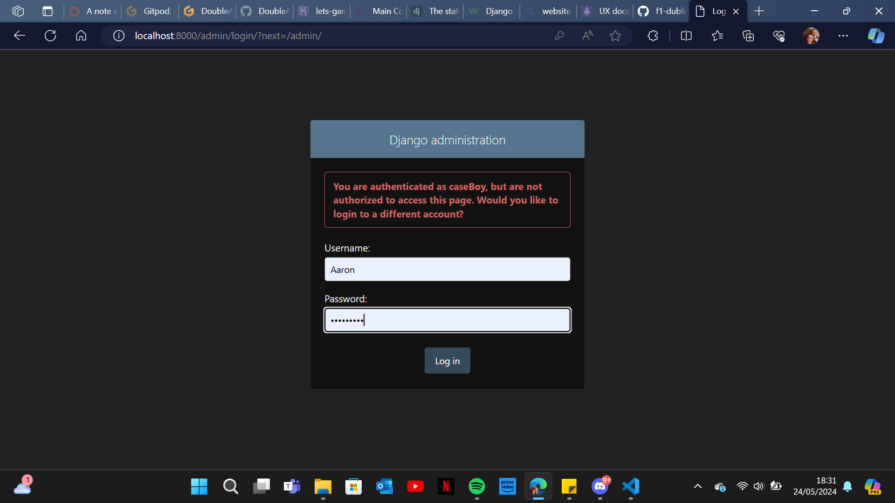
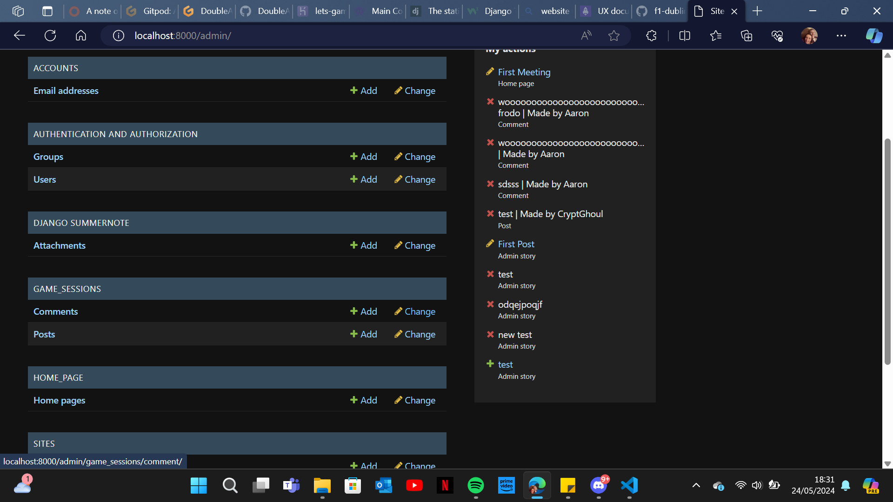
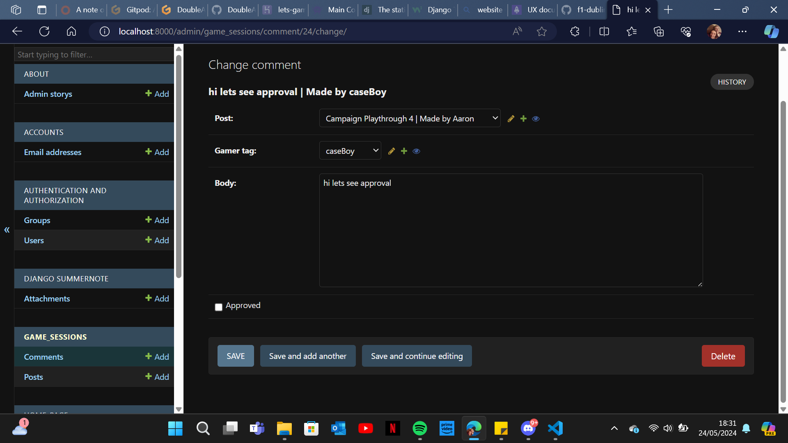

### Game Together

## Introduction
Welcome 
thank you for looking thought the ReadMe.
the Game together project is a personal one to help fill a need i felt that was needed. this project is a basic and simple idea, like the project its self the layout and logic is simple to run on this project, the plan is to make a platform that can bring adults and young adults together by making gaming in groups more of an easy task.

## Visit the Website Here
[website link](https://lets-game-together-a5473aa86515.herokuapp.com/)

## Visit the Project's GitHub Repository Here
[Repo link](https://github.com/DoubleARon96/project-4-gamer-group)

## Website Highlights

# UX
the UX is a main part of the site by making it simple and easy to understand parts of the ux are 
* Strategy
* Scope
* Structure
* Skeleton
* Surface

## Strategy

When planning the site I could relate to the group i am aiming to draw in.

so when planning i thought about how i struggle to play groupe games now because all my friends have different hours, so i thought if i could make a site that can be assessed at anytime and responses don't have to be instant.

Target audience :
* 18 to 50 years old 
* people that are working full time and have not a lot of spare time.
* people that like to game in groups 

## Purpose
the purpose of this website it to be able to bring people together in a controlled and monitored way while gaming.
the plan is to make it easier for people like me that don't have much spare time to game and when they do they cant find anyone to play with, so with this i added functions to the site so that admins and superusers can make sessions and only registered people can join for extra protection.

## User Stories

[link to project stories](https://github.com/users/DoubleARon96/projects/5/views/1)
all major stories where completed and moved across when working on and done.

## For the Future
the future i plan to add more interactivity like an voice chat to the sessions the users will be able to post images from games and have a profile with a logo or profile picture.
Scope

# Structure
the structure of the project is a very basic layout so its easy to use and look through the page and works with the datable so pages can be updated and changed from the admin page and all questions can be changed and and deleted.

## Project Databases

this was my original plan for the data bases but i have adjusted it to work with the project now. there is three data bases one for the home page welcome message , the game sessions and the about page.

## Accounts 
the accounts are the authentication so users can get around the site and if they don't meet the requirements they wont be able to get around the site.

## Posts/Sessions
within this it will hold the users data that made it and will have players that leave questions in the question part, it will also store the game , the amount of players and a brief description of what the host has planned 

the models can be broken down into

* Post_id - text value for selection 
* Gamer_tag - user name for account
* Datetime - this is to choose the date for the session 
* Game - the game the user is planning to play or other if its not on the list
* Player_count - this is to tells the data base the maximum amount of players
* Updated_on - this records any time the data has been changed
* Slug - the slug was made because i had an issue with the post_id when the comments would link properly
* Joined_status - this is a boolean for join (not currently used)

# Surface
the surface is the look of the page basically the html and css 
## Font
sadly I haven't added a basic font to the website.

## Icons
Icons i used where from font awesome

## Colours
i choose the green white and black because the glow makes it feels more game like and simple colours so its not hard to see or read the text 

## Responsive Screens
i made the site responsive with the help of bootstrap because of the columns and being able to make it fit the page no matter what screen the user is using.

# Features

  ## Home Page
  the home page has a welcome message on to from the admins this will change manually by the admin throughout the year for different seasons 
  

  ## Navigation Bar
  the nav bar will change depending on if you have logged in or not. this is to stop non account holders from leaving messages without being able to find out who did it for safety

  ## Questions
  the question or comments are there to get a little more information from the users that made the game session, so you can ask what mode , mission or if they will host another session to.
  
  ## Approval
  
  1. 
  2. 
  3. 
  4. 

## Django Template Pages
This project utilises allauth to allow users to register, login, logout etc. on the website and provides excellent out-of-the-box functionality.
 
# Technologies Used
## Languages
* HTML - To create the Django templates for the associated views and models in the project applications.
* CSS - To style the website.
* JavaScript - to handle the buttons that questions and to make a new story on the about page
* Python – Is the primary language of Django and used to create all forms, models and views.
## Tools
* Django – The framework used in this project to join the databases with a website.
* Crispy Forms – Formats the models into forms on webpages.
* Gitpod – Used as the development environment.
* GitHub – The project’s Version Control.
* Heroku – To deploy the webpage.
* [animate](https://animate.style/) - I used this for animations but haven't got around to adding them 
* [git commits](https://dev.to/phukon/how-i-write-commits-like-a-pro-340l?ref=dailydev) - I used this to help word and set out my commits
## Styling
* Bootstrap – To provide extra styling and positioning.
* Font Awesome – For the X's on the questions awaiting approval.
* animate.style - For animations
## Validation
* W3C HTML Validation Service – To validate all the HTML files, including the templates from Django itself, due to editing them.
* W3C CSS Validation Service – To validate the “style.css” page as well as the specific css page made to create the 
* JSHint – To validate the code within the “script.js” file.
* Python Syntax Checker PEP8 – To validate all the Python files, making sure they align with PEP8.
* Lighthouse – To check the website’s performance and accessibility, making sure the best practices are used.

# Databases
* ElephantSQL – The final database used for the deployed project.

# Testing
[manual testing](MANUAL_TESTS.md "link to manual testing")

# Deployment
to deploy the project you will need to follow these :

1. Create Application
* Create a Heroku account if you don’t have one and login.
* Create a new application, by selecting the “new” button on the top right of the dashboard and click “Create new app”.
* Choose a unique name for the application and select the region you live in, followed by "Create App".
 
2. ElephantSQL
* Go to elephantsql.com, login with GitHub and create a new instance.
* Copy the URL once the project has been created.
* Install the dj-database-url package version 0.5.0 by using [pip3 install dj_database_url==0.5.0] to format the URL into one that Django can use, and don't forget to [pip freeze > requirements.txt].
 
3. Repo Preparations
* Make sure to make any migrations in the project, by typing [python3 manage.py makemigrations] followed by python3 [manage.py migrate] into the terminal.
* make a Procfile, which contains web: gunicorn [project_name].wsgi:application is added to the project.
 
4. Heroku Deploy
* Go back to Heroku and when the Project’s page opens up, go to the "settings" tab and scroll down to the “Config Vars” section.
* Enter the following key-value pairs in the “Config Vars” section:
* Key = PORT : Value = 8000
* Key = SECRET_KEY : Value = Django Secret Key value obtained from settings.py
* Key = DATABASE_URL : Value = ElephantSQL URL From the website.

* Go to the “Deploy” tab next and scroll down to the GitHub deployment method.
* Search for the sight repository and then connect to it by selecting the “Connect” button.
* Scroll down to the bottom of the “Deploy” Page and select the type of deployment you want to do. If you opt to “Automatically Deploy”, it will deploy every time you push new code to your repository or you will have to manually deploy it, by selecting the button at the bottom of the page.
The application is now deployed!
 
## Bugs 
# bug that are still there
1. when making a game session you still have to write the post_id in the top one and the slug field second from the bottom

## GitPod Reminders

To run a frontend (HTML, CSS, Javascript only) application in Codeanywhere and gitpod in the terminal, type:

`python3 -m http.server`

A button should appear to click: _Open Preview_ or _Open Browser_.

To run a frontend (HTML, CSS, Javascript only) application in Codeanywhere with no-cache, you can use this alias for `python3 -m http.server`.

`http_server`

To run a backend Python file, type `python3 app.py`, if your Python file is named `app.py` of course.

A button should appear to click: _Open Preview_ or _Open Browser_.

## Credit
Ciaran Merrit
Code institue : i think blog
Grawnya : helped by showing and amazing Readme layout
Harry Dhillon